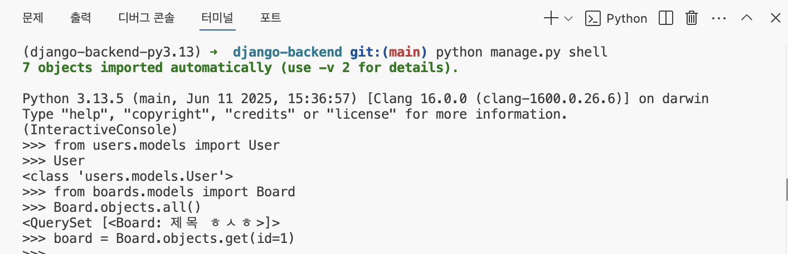

day1~day4 정리 및 복습(지피티와 강의노트)

가상환경 설정

*프로젝트마다  가상환경 설정을 해야하는 이유는?

(안전하게 프로젝트를 관리)

:>상황

a 프로젝트 - Django 3.2 사용
b 프로젝트 - Django 5.2 사용

=> 같은 환경에서 둘 다 설치하면 충돌 or 버그

:>만약에 가상 환경 없이 pip install 을 한다면?
-> 내 컴퓨터 전체에 Django를 설치 
-> 어떤 프로젝트에서든 무조건  현재 설치한 버전의
Django가 사용 될 수 있음
-> 버전 충돌 에러 위험 증가

:> 협업과 배포가 쉬워짐
pyproject.toml이나 requirements.txt만 공유 하면
동료들도 poetry install 만으로 같은 환경을 바로 만들 수 있음
서버에서도 똑같이 세팅 할 수 있으니 배포시 안정적

poetry init 입력

결과:>
현재 폴더를 Poetry 프로젝트로 등록하면서,
pyproject.toml 이라는 설정 파일을 만들어주는 명령어.

pyproject.toml은 뭐에 쓰이냐면?
현재 프로젝트에 어떤 패키지(예: django,request등)을 쓰는지
어떤 파이썬 버전이 필요한지,
프로젝트 이름 , 버전, 설명 등이 쓰임

poetry add django 입력

결과 :>
프로젝트 전용 가상환경 생성 후
그 가상환경에 Django 설치됨
pyproject.toml에  사용한 버전 까지 등록됨

poetry shell 입력

-> poetry가 만든 가상환경에 진입하는 명령어

django-admin startproject config . 입력

결과:> config폴더 + manage.py 만들어짐

-> 장고 프로젝트 생성 시 사용 (중요)
-> Django 기본 프로젝트 구조를 세팅 해줌

. = 현재 위치에 프로젝트를 생성 하시오
config = 프로젝트 설정 파일들이 들어갈 폴더명
*_*config = 관례적으로 자주 쓰는 이름일뿐 원한다면 
폴더명 바꿔도된다고함,,

개발 서버 실행
1.django-admin runserver

2.python manage.py runserver 을 더 많이쓴다고함

python manage.py create superuser -> 관리자 계정 생성

python manage.py makemigrations
-변경사항을 기록함 
-> 결과 : migrations/0001_initial.py 같은 파일 생성됨

python manage.py migrate
->변경된 사항을 db에 반영
->db.sqllite3에 반영됨 

python manage.py startapp feeds
: 새로운 앱(작은 기능 단위)을 생성

앱 : 기능 단위 예) 뉴스,카페,쇼핑,회원 

결과:> 여러 기본 파일 들이 만들어짐

models.py : 데이터베이스 테이블 정의
views.py : 사용자가 요쳥한 기능 처리
admin.py : Django 관리자 페이지 설정
apps.py : 이 앱의 설정 정보
migrations/  : 데이터베이스 이력 저장 폴더

해야 할 일:>
settings.py 에 새로만든 앱 등록하기

#config/settings.py 

INSTALLED_APPS = [
	…
	‘feeds’, #추가하기
]

URL Dispatcher이란?
사용자가 웹사이트에 입력한 주소 URL을 urls.py에서 
참고하여 views.py에 위치한 어떤 코드와 연결해줄지
결정해주는 Django의 시스템

예:)

 #config/urls.py
생략,,
urlpatterns = [
	path(“admin/”, admin.site.urls),
	path(“feeds/”, views.show_feed),
	…
]

#feeds/views.py
생략,,
def show_feed(request):
	return HttpResponse(“show feed”)

만약 사용자가 주소에 http://127.0.0.1:8000/feeds/를 입력 했으면
urls.py 에서 path(“feeds/”, views.show_feed)로
가서 views.py의 def show_feed(request):
	return HttpResponse(“show feed”)
와 연결됨

Model 이란?

데이터베이스  테이블과 파이썬 클래스를 연결
모델을 사용 -> 복잡한 sql 쿼리 없이 db 간편하게 조작

기본 개념 :)

django.db.models.Model 클래스를 상속 받음
상속 =>  Django가 미리 만든 “부모클래스”인 models.Modeld의
기능을 물려받음
models.Model 안에는
db랑 연결
저장/조회/수정/삭제
테이블로 자동 변환 해주는 기능이 이미 구현되어 있음

2. 필드 정의 : 저장하고자 하는 데이터의 종류(문자열, 숫자, 날짜)에 따라 결정됨 (데이터베이스의 열 Column에 해당됨)

필드를 정의한다
= 데이터베이스에 어떤 열을 만들지 결정한다.

3.데이터베이스 테이블과의 매핑(연결)
- 장고는 모델 클래스를 기반으로 -> 데이터베이스 테이블 생성
클래스 이름 = 테이블 이름
클래스 필드 =테이블의 열

4. ORM 기능 
-모델을 통해 CRUD작업을 sql 쿼리를 작성하지 않고 수행

모델 사용

python manage.py makemigrations

:)
Django가 model.py 를 보고 변경된 사항을
0001_initial.py 로 생성

python manage.py migrate
:)
makemigrations로 만든 파일을 실제로 데이터베이스에 적용

ORM과 쿼리셋

ORM : 객체(object)와(relational database)를 자동으로 연결해주는 기술
쿼리셋 :orm을 통해 데이터베이스에서 조회된 데이터 결과를 리스트 처럼 다룰 수 있게  해주는 기능

쿼리셋 종류 :)

.all( ) 전체 데이터 가져오기
.filter( ) 조건에 맞는 데이터만 가져오기
.get( ) 하나의 데이터만 가져오기(없거나 많으면 오류)
.exclude( ) 조건에 맞지 않는 데이터 가져오기
.order_by( ) 정렬하기
.count( ) 개수 세기
.exists( ) 	존재 여부 확인

예시:>
	1. 책 전체 가져오기
Book.objects.all( )

	2. 동동걸 이 작가인 책 만 가져오기
Book.objects.filter(author=‘동동걸’)
	3. 제목이 코딩초보자의기록 인 책 1개 가져오기
Book.objects.get(title=‘코딩초보자의기록’)
	4.책 제목을 가나다순 정렬
Book.objects.order_by(‘title’)

 
쿼리셋 쉽게 실행하는 법:)

python manage.py shell을 터미널에 입력

그 다음에 조회하고 싶은 feeds라는 앱에 있는 
models.py에서 Book이라는 클래스를 불러온다..

from feeds.models import Book
만약 전체 책 목록을 리스트 형태로 보고싶다면?
books =Book.objects.all( )
for book in books:
	print(book.title)

Lazy evaluation(지연 평가)

:> 장고 orm에서 쿼리셋을 만들 었을 때 바로 db에 접근하지 않고
실제로 데이터가 필요해질 때 sql을 실행

왜 이렇게 하는 거야?:>
지금 안 쓸 데이터를 미리 불러오면 비효율적이라서

